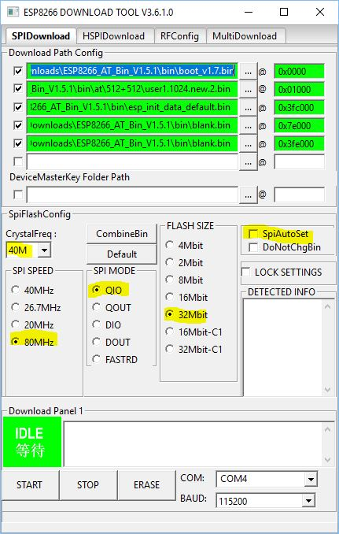
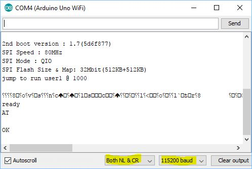

# UNO WiFi (Developer Edition) Serial1

Arduino UNO WiFi is an Arduino UNO R3 with ESP8266 integrated on the board. It was developed and manufactured by Arduino.org. More information in [UNO WiFi Wiki](https://github.com/jandrassy/UnoWiFiDevEdSerial1/wiki).

UNO WiFi Developer Edition connects ATmega328 to ESP8266 using additional on board UART chip SC16IS750. This additional UART is connected to ATmega as I2C device.

This library creates a Serial1 object with SC16IS750 on Arduino UNO WiFi Developer Edition. This Serial1 enables to communicate with the on-board ESP8266 over it's serial interface. The included tool EspProxy enables accessing the on-board ESP8266 over USB for 'flashing' tools, IDE sketch upload or Serial Monitor.

The release version of the library is available in Library Manager in IDE.

Use for:
* [UNO WiFi with Espressif AT firmware](#uno-wifi-with-espressif-at-firmware)
* [UNO WiFi with WiFi Link firmware](#uno-wifi-with-wifi-link-firmware)
* [write sketches for ESP8266 with Firmata in ATmega](#writing-sketches-for-esp8266).

## UNO WiFi with Espressif AT firmware

### Prepare

Download the AT firmware from [Espressif download page](http://espressif.com/en/support/download/at?keys=&field_type_tid%5B%5D=14) and unzip it. Replace the esp_init_data_default.bin with [this one](https://github.com/jandrassy/UnoWiFiDevEdSerial1/wiki/files/esp_init_data_UnoWiFi.bin). It has the 40MHz crystal setting. 

1. Open in IDE the EspProxy.ino from UnoWiFiDevEdSerial1 examples tools subfolder.
2. Uncomment the `#define FLASHING` line (remove the `//` at the beginning of the line) 
3. Upload the EspProxy sketch into UnoWiFi. (No need to save it.)
4. let the sketch open in IDE

### Option 1 - flashing with esptool.py

Install Python 2.7 and [esptool](https://github.com/espressif/esptool).

Go on command line in the folder with the AT firmware files and run the following command with the COM port of your UNO WiFi:

`esptool.py -p COM-PORT write_flash -ff 80m -fm qio -fs 4MB 0x0 boot_v1.7.bin 0x01000 at/512+512/user1.1024.new.2.bin 0x3fc000 esp_init_data_default.bin 0xfe000 blank.bin 0x3fe000 blank.bin`

### Option 2 - flashing with Espressif Flash Download Tools (Windows)

Download the tool from [Espressif download page](http://espressif.com/en/support/download/other-tools), unzip it and run.

Select files, addresses and settings like on this picture:

Use the Start button to execute.

Note: In field DETECTED INFO the detected frequency will be half of the real frequency. That is why the SpiAutoSet must not be checked.

### Checking the firmware

1. Return to EspProxy.ino sketch in the IDE
2. Comment the `#define FLASHING` line (make Undo or put `//` at the beginning of the line) 
3. Upload the EspProxy sketch into UnoWiFi.

Open the Serial Monitor. EspProxy sketch resets the ESP and you will see the boot log at 115200 baud. The strange characters sequence is normal.

Set the CR/LF setting and send test command 'AT'. The ESP should replay with OK.

Next commands:
* AT+CWMODE=1 sets tha STA mode
* AT+CWJAP="ssid","pass" connects to AP
* AT+CIUPDATE updates the firmware to the latest version
* AT+GMR - prints the version
* AT+UART_DEF=115200,8,1,0,0 - setting of the default baud rate

### Example sketch with WiFiEsp library

Install the [WiFiEsp library](https://github.com/bportaluri/WiFiEsp).

Open the WiFiEspWebClient example. Change the WiFi credentials and upload the sketch.

WiFiEsp library has timeout issues. One of them causes buffer overflow with UNO WiFi Serial1. Instructions are in the example sketch.

### New WiFiEspAT library

With AT firmware 1.7 (SDK 3), you can use the new [WFiEspAT library](https://github.com/jandrassy/WiFiEspAT).

To test it, only add `#include <UnoWiFiDevEdSerial1.h>` at the beginning of the example sketches of the WiFiEspAT library.

## UNO WiFi with WiFi Link firmware

WiFi Link firmware is an Arduino esp8266 core sketch. It can by installed by Uploading from source code in IDE, with EspProxy sketch in ATmega.

To make UNO WiFi ready for WiFi Link flashing, open in IDE the EspProxy.ino from UnoWiFiDevEdSerial1 examples tools subfolder and upload it into UNO WiFi. EspProxy will reset the ESP8266 into bootloader mode always when the Atmega is reset with DTR signal from IDE and esp flashing is detected.

To build the WiFi Link for the UNO WiFi [install esp8266 support in IDE](https://github.com/jandrassy/UnoWiFiDevEdSerial1/wiki/Programming-ESP8266).

Repository and 
instructions for generic board/module with ESP8266 are [here](https://github.com/jandrassy/arduino-firmware-wifilink).

The version of WiFi Link library modified for use with any serial implementation is [here](https://github.com/jandrassy/arduino-library-wifilink).

An example for UNO WiFi with Serial1 is in examples of the UnoWiFiDevEdSerial1 library.

For Blynk with UNO WiFi with Serial1 and WiFi Link library, see UnoWiFiBlynk example.

## Writing sketches for ESP8266

Firmata is a system for accessing pins and interfaces of a microcontroller (MCU) from a computer (or other MCU). Library [FirmataMaster](https://github.com/gmag11/FirmataMaster) is for esp8266 and enables control of an attached MCU with Firmata.

Example UnoWiFiFirmata shows how to modify a Firmata sketch to work with Serial1 and combine it with EspProxy features to upload sketches into esp from IDE without thinking about how is it connected and without caring about flashing mode.

To build and upload sketches into esp you need [esp8266 support in IDE](https://github.com/jandrassy/UnoWiFiDevEdSerial1/wiki/Programming-ESP8266) and in ATmega the EspProxy sketch or other sketch with automatic 'flashing bridge' like the UnoWiFiFirmata example. 

## Serial1 overflow

Creators of the UNO WiFi did not connect the interrupt pin of the SC16IS750. It is not possible to start receiving from SC16IS750 into Serial1 buffer on interrupt. SC16IS750 has 64 byte RX buffer. If this receive buffer is full, SC16IS750 sets the overflow flag and more bytes are not received. The sketch or library then stops while waiting for declared count of bytes.

After requesting data from ESP, it is necessary to check for incoming data without delays. It takes time before a http response arrives, but then the data come fast. 

Serial1 objects has overflow() function which checks the overflow flag of SC16IS750. It is useful for debugging overflow situations.

## I2C a.k.a. Wire a.k.a. TWI

Serial1 is an I2C device with address 0x48. Like other devices libraries, it calls twi_init in Serial1.begin() function. With baud rates over 57600, Serial1 sets the I2C 'full speed' (400 kHz). Call Serial1.begin() after initializing other I2C devices.

Serial1 can handle 230400 baud at I2C 'full speed', but only 57600 at I2C 'standard mode' (100 kHz).

